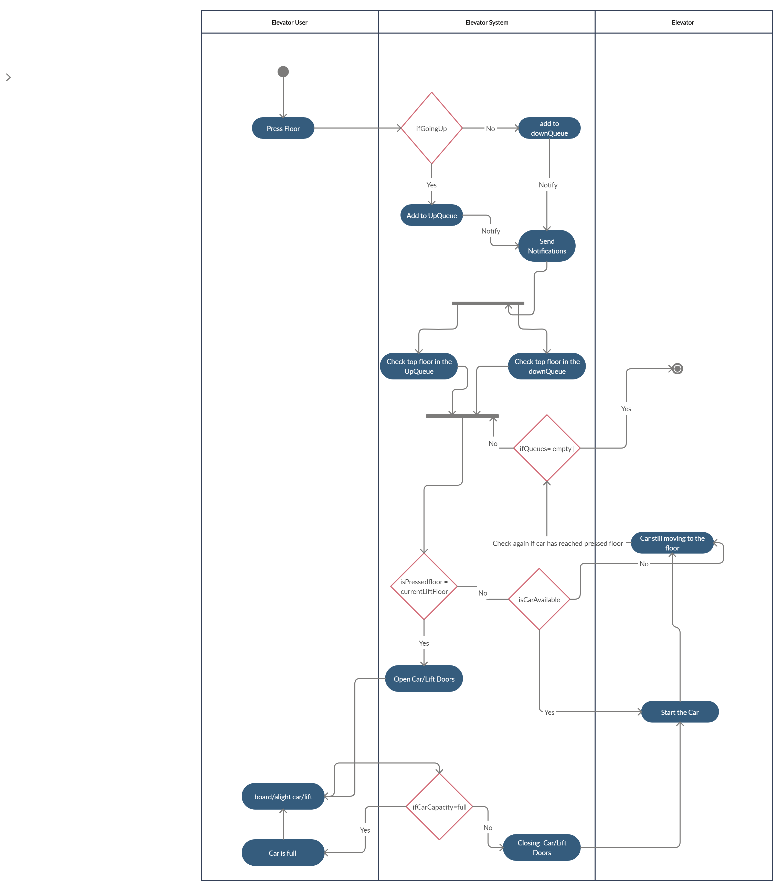
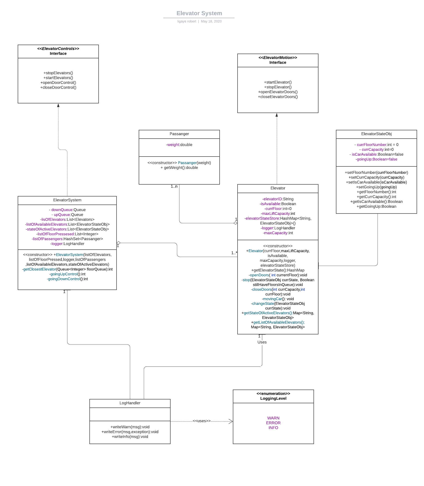

<h1><b>Elevator System Design</b></h1>
 
<h2>Requirement</h2>
<h4>For Users</h4>
<datalist>
    <li>Call an elevator by pressing buttons in lobby</li>
    <li>Choose a floor</li>
</datalist>

<h4>For Elevator System</h4>
<datalist>
    <li>Get a list of the floors where the elevator is supposed to stop.</li>
    <li>Optimally choose any elevator and send it to the requested floor.</li>
    <li>Get available Elevators.</li>
    <li>Manage the passangers based on lift/car capacity </li>
</datalist>

<h4>For Elevator lift/car</h4>
<datalist>
    <li>Show the changes in floors where the lift/car is currently at. </li>
    <li>Show the direction of motion (up/down).</li>
</datalist>

<h4>Activity Diagram</h4>

  
 

<h4>Class Diagram</h4>

  
 
